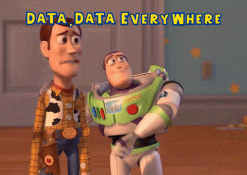

# CPanel DB Admin 
⚙️ Configuring Databases in the CPanel Area. 

📝 Note that not all feature is not available as some of the access is handled by the CPanel Dashboard.

📲 This project is only a mere interface that allow multiple people in the same domain to have an account that attached to their own database even it is in 1 domain.

🐐This project is still early on stage on do not expect to be finish in the near future. But it will progressively be updated to reach the purposes it built for.

Bugs 🪲. Please expect it since this project is my first project to go with React.js instead of full PHP.

📎Any reporting or recommendation. Please contact me at [Amirul-Hub.com](https://amirul-hub.com/#contact)

## Tech Stack 🧑‍💻
| Technology | Language |
| -------- | -------- |
| Front End | React.js  Material-UI
| Back End | PHP   Javascript |
| Database | MySQL |
| Server | Shared Hosting |

Enjoy 🥳

